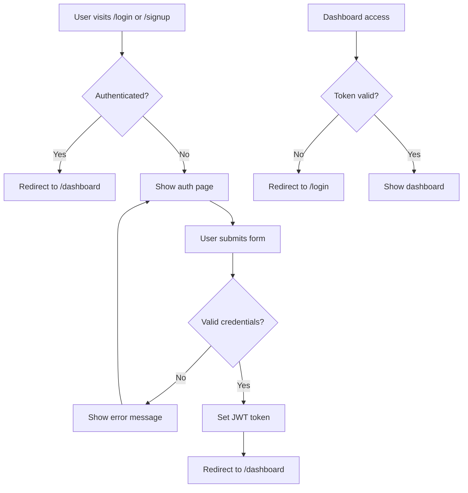

# Design Document

## Overview

The authentication dashboard feature will provide a complete authentication system for QubitCore, consisting of three main components: login page, signup page, and a main dashboard for authenticated users. The system will integrate with the existing Next.js application architecture, utilizing React Hook Form for form management, Zod for validation, and the established UI component library.

The design emphasizes security, user experience, and seamless integration with QubitCore's four services (Aegis, Shield, Ledger, and Synapse). The authentication pages will feature a distinctive split-screen layout with forms on the right and testimonials on the left, while the dashboard will provide comprehensive API key management and service monitoring capabilities.

## Architecture

### Technology Stack
- **Frontend Framework**: Next.js 15 with React 19
- **Form Management**: React Hook Form with Zod validation
- **State Management**: Zustand for global state
- **API Client**: Axios with React Query for data fetching
- **UI Components**: Radix UI primitives with custom styling
- **Styling**: Tailwind CSS with custom design tokens
- **Authentication**: JWT tokens with secure session management

### Authentication Flow


### Route Structure
- `/login` - Login page with form and testimonials
- `/signup` - Signup page with form and testimonials  
- `/dashboard` - Main authenticated dashboard
- `/dashboard/api-keys` - API key management
- `/dashboard/monitoring` - Usage monitoring
- `/dashboard/settings` - Account settings

## Components and Interfaces

### Authentication Pages Layout
Both login and signup pages will share a common layout structure:

```typescript
interface AuthPageProps {
  type: 'login' | 'signup';
  testimonial: {
    quote: string;
    author: string;
    role: string;
    company: string;
  };
}
```

**Layout Structure:**
- Left side (60% width): Dark background with testimonial content
- Right side (40% width): White background with form
- Responsive design that stacks vertically on mobile

### Form Components

**Login Form:**
```typescript
interface LoginFormData {
  email: string;
  password: string;
  rememberMe?: boolean;
}
```

**Signup Form:**
```typescript
interface SignupFormData {
  name: string;
  email: string;
  password: string;
  confirmPassword: string;
  organization?: string;
  industry?: string;
  acceptTerms: boolean;
}
```

### Dashboard Components

**Main Dashboard Layout:**
- Header with user profile and logout
- Sidebar navigation for different sections
- Main content area with service overview cards
- Quick actions panel for common tasks

**Service Overview Cards:**
```typescript
interface ServiceCard {
  id: 'aegis' | 'shield' | 'ledger' | 'synapse';
  name: string;
  description: string;
  status: 'active' | 'inactive' | 'setup_required';
  usageMetrics: {
    requests: number;
    limit: number;
    period: string;
  };
  quickActions: Array<{
    label: string;
    action: string;
    icon: string;
  }>;
}
```

**API Key Management:**
```typescript
interface APIKeyDisplay {
  id: string;
  name: string;
  permissions: string[];
  created: Date;
  lastUsed?: Date;
  status: 'active' | 'revoked';
  usageCount: number;
  usageLimit: number;
}
```

## Data Models

### User Authentication
```typescript
// Extends existing User type from src/types/user.ts
interface AuthenticatedUser extends User {
  sessionToken: string;
  tokenExpiry: Date;
  refreshToken: string;
  lastActivity: Date;
}
```

### Session Management
```typescript
interface UserSession {
  userId: string;
  token: string;
  refreshToken: string;
  expiresAt: Date;
  createdAt: Date;
  lastActivity: Date;
  ipAddress: string;
  userAgent: string;
}
```

### Dashboard State
```typescript
interface DashboardState {
  user: AuthenticatedUser;
  apiKeys: APIKey[];
  serviceMetrics: Record<string, ServiceMetrics>;
  notifications: Notification[];
  preferences: UserPreferences;
}

interface ServiceMetrics {
  serviceId: string;
  requests: number;
  limit: number;
  period: string;
  lastRequest: Date;
  errorRate: number;
  avgResponseTime: number;
}
```

## Error Handling

### Authentication Errors
- Invalid credentials: Clear, user-friendly error messages
- Account locked: Informative message with support contact
- Network errors: Retry mechanism with exponential backoff
- Token expiry: Automatic refresh or redirect to login

### Form Validation
- Real-time validation using Zod schemas
- Field-level error display
- Form-level error summary
- Accessibility-compliant error announcements

### API Error Handling
```typescript
interface APIErrorResponse {
  code: string;
  message: string;
  details?: any;
  timestamp: string;
}

// Error handling strategy
const handleAPIError = (error: APIErrorResponse) => {
  switch (error.code) {
    case 'INVALID_CREDENTIALS':
      return 'Invalid email or password';
    case 'ACCOUNT_LOCKED':
      return 'Account temporarily locked. Please contact support.';
    case 'RATE_LIMITED':
      return 'Too many attempts. Please try again later.';
    default:
      return 'An unexpected error occurred. Please try again.';
  }
};
```

## Testing Strategy

### Unit Testing
- Form validation logic with Zod schemas
- Authentication utility functions
- API client methods
- Component rendering and interactions

### Integration Testing
- Authentication flow end-to-end
- API key generation and management
- Dashboard data loading and updates
- Error handling scenarios

### E2E Testing
- Complete user registration flow
- Login and logout functionality
- Dashboard navigation and interactions
- API key lifecycle management

### Security Testing
- Input sanitization and validation
- XSS prevention
- CSRF protection
- JWT token security
- Session management security

### Test Structure
```typescript
// Example test structure
describe('Authentication Flow', () => {
  describe('Login Page', () => {
    it('should validate email format');
    it('should show error for invalid credentials');
    it('should redirect to dashboard on success');
  });
  
  describe('Signup Page', () => {
    it('should validate password strength');
    it('should check password confirmation match');
    it('should create account and redirect');
  });
  
  describe('Dashboard', () => {
    it('should load user data and services');
    it('should generate API keys');
    it('should display usage metrics');
  });
});
```

### Performance Considerations
- Lazy loading of dashboard components
- Optimistic updates for API key operations
- Efficient state management with Zustand
- Image optimization for testimonial avatars
- Code splitting for authentication vs dashboard bundles

### Security Measures
- JWT token storage in httpOnly cookies
- CSRF token validation
- Rate limiting on authentication endpoints
- Input sanitization and validation
- Secure session management
- Password strength requirements
- Account lockout after failed attempts

### Accessibility
- WCAG 2.1 AA compliance
- Keyboard navigation support
- Screen reader compatibility
- High contrast mode support
- Focus management for form interactions
- Semantic HTML structure