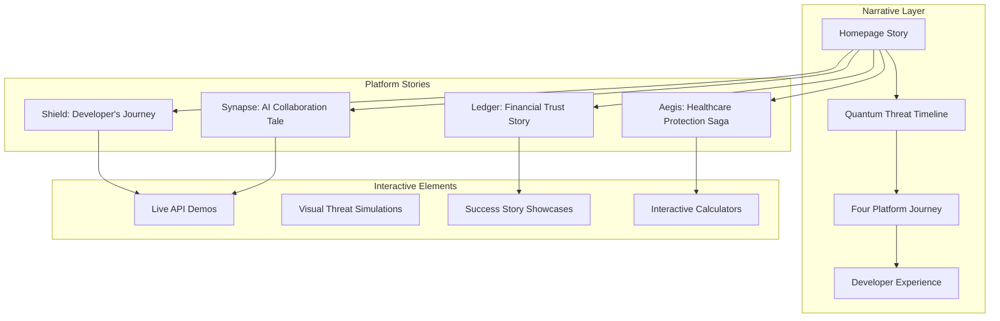
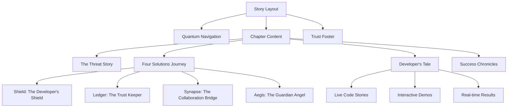
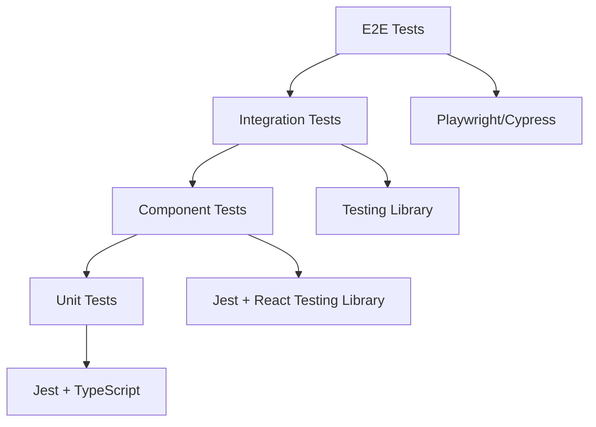

# Design Document

## Overview

The QubitCore Platform Frontend is a story-driven, multi-platform web application built with Next.js 15, React 19, and TypeScript. Inspired by Upstash's clean, narrative approach, the platform presents QubitCore's four quantum security solutions (Shield, Ledger, Synapse, Aegis) as interconnected chapters in the quantum security story.

The design emphasizes storytelling over feature lists, using Shadcn UI components to create compelling visual narratives that guide users through the quantum threat landscape and demonstrate how each platform solves specific real-world problems. Each page tells a story rather than just displaying features, creating an emotional connection with the quantum security mission.

## Architecture

### Story-Driven Architecture



### Technology Stack (Upstash-Inspired)

**Core Framework:**
- **Next.js 15** with App Router for server-first architecture
- **React 19** with Server Components for optimal performance
- **TypeScript** for type safety and developer confidence

**UI & Storytelling Libraries:**
- **Shadcn UI** as the primary component library foundation
- **Magic UI** for advanced animated components (Marquee, Animated Beam, Dock, Globe)
- **Aceternity UI** for stunning visual effects (Aurora Background, Floating Navbar, Spotlight)
- **Tremor** for beautiful data visualizations and quantum security metrics
- **React Flow** for interactive quantum threat timelines and system architecture diagrams
- **Recharts** integrated with Shadcn for quantum analytics and threat progression charts
- **Vaul** for smooth drawer components in mobile storytelling
- **Sonner** for elegant toast notifications during API demonstrations
- **React Hot Toast** for user feedback during interactive demos
- **Embla Carousel** for smooth platform story carousels
- **React Intersection Observer** for scroll-triggered story animations
- **React Countup** for animated metrics and success counters
- **React Typed** for typewriter effects in threat narratives
- **React Particles** for quantum-themed background animations
- **Framer Motion** for story-enhancing page transitions and micro-interactions
- **React Spring** for physics-based animations demonstrating quantum concepts
- **Lottie React** for complex quantum visualization animations
- **React Syntax Highlighter** with Shiki for beautiful, story-driven code examples

**Developer Experience:**
- **TanStack Query** for seamless API state management
- **React Hook Form** with Zod for bulletproof form validation
- **Zustand** for lightweight client state when needed

**Content & Storytelling:**
- **MDX** for rich, interactive educational content
- **Shiki** for beautiful code syntax highlighting
- **React Syntax Highlighter** for live code examples
- **Cookies-next** for seamless authentication flow

## Story-Driven Components & Interfaces

### Narrative Component Architecture (Upstash-Inspired)



### Story Components (Built with Shadcn UI)

#### 1. Narrative Layout Components

**StoryLayout** (Upstash-style clean layout)
```typescript
interface StoryLayoutProps {
  children: React.ReactNode;
  chapter?: 'threat' | 'shield' | 'ledger' | 'synapse' | 'aegis';
  showProgress?: boolean;
}

// Uses Shadcn UI: Card, Badge, Progress components
```

**QuantumNavigation** (Clean, minimal like Upstash)
```typescript
interface QuantumNavProps {
  currentChapter: string;
  userType: 'developer' | 'enterprise' | 'visitor';
}

// Uses Shadcn UI: NavigationMenu, Button, Avatar components
```

#### 2. Homepage Story Components

**ThreatNarrative** (The opening story)
```typescript
interface ThreatNarrativeProps {
  showAnimation?: boolean;
  userIndustry?: Industry;
}

// Story: "Your data is already stolen. They're just waiting..."
// Uses Shadcn UI: Card, Alert, Progress, Badge
// Visual: Animated timeline showing quantum progress vs current encryption
```

**FourPlatformsJourney** (Like Upstash's three services)
```typescript
interface PlatformJourneyProps {
  selectedPlatform?: Platform;
  onPlatformSelect: (platform: Platform) => void;
}

// Story: Four interconnected solutions for the quantum age
// Uses Shadcn UI: Tabs, Card, Button, Badge
// Layout: Clean grid like Upstash Redis/Vector/Qstash
```

**QuantumReadinessCheck** (Interactive assessment)
```typescript
interface ReadinessCheckProps {
  onComplete: (score: number, recommendations: string[]) => void;
}

// Story: "How ready is your organization?"
// Uses Shadcn UI: Form, RadioGroup, Progress, Alert
```

#### 3. Platform Story Pages (Each tells a unique story)

**ShieldStory** - "The Developer's Quantum Shield"
```typescript
interface ShieldStoryProps {
  userType: 'new' | 'exploring' | 'integrating';
}

// Story Arc:
// 1. "Meet Sarah, a developer like you..."
// 2. "Her encryption was broken in 2029..."
// 3. "Here's how Shield would have saved her..."
// 4. "Try it yourself in 30 seconds"

// Uses Shadcn UI: Card, Tabs, CodeBlock, Button, Badge
```

**LedgerStory** - "The Trust Keeper's Tale"
```typescript
interface LedgerStoryProps {
  industry: 'banking' | 'fintech' | 'insurance';
}

// Story Arc:
// 1. "The $2B transaction that never happened..."
// 2. "When quantum computers broke the audit trail..."
// 3. "How Ledger creates unbreakable trust..."
// 4. "See your transactions protected forever"

// Uses Shadcn UI: Card, Timeline, Badge, Alert, Button
```

**SynapseStory** - "The Collaboration Bridge"
```typescript
interface SynapseStoryProps {
  useCase: 'healthcare' | 'research' | 'finance';
}

// Story Arc:
// 1. "Three hospitals, one breakthrough..."
// 2. "The AI model that saved lives without seeing data..."
// 3. "How Synapse enables impossible collaborations..."
// 4. "Start your secure AI project"

// Uses Shadcn UI: Card, Progress, Avatar, Badge, Button
```

**AegisStory** - "The Guardian Angel"
```typescript
interface AegisStoryProps {
  patientType: 'chronic' | 'genetic' | 'mental-health';
}

// Story Arc:
// 1. "Emma's genetic data will outlive her..."
// 2. "The breach that exposed a lifetime of secrets..."
// 3. "How Aegis protects health data forever..."
// 4. "Secure your patients' future"

// Uses Shadcn UI: Card, Alert, Progress, Badge, Button
```

#### 4. Interactive Story Elements

**LiveCodeStory** (Like Upstash's interactive examples)
```typescript
interface LiveCodeStoryProps {
  platform: Platform;
  scenario: string;
  initialCode: string;
}

// Interactive code playground with real API calls
// Uses Shadcn UI: Tabs, Card, Button, Badge, Alert
// Shows before/after quantum threat scenarios
```

**ThreatSimulator** (Visual storytelling)
```typescript
interface ThreatSimulatorProps {
  threatType: 'harvest-now' | 'quantum-break' | 'data-exposure';
  userIndustry: Industry;
}

// Interactive visualization of quantum threats
// Uses Shadcn UI: Card, Progress, Alert, Badge
// Shows timeline: "Your data encrypted today → Quantum computer → Data exposed"
```

**SuccessChronicle** (Customer story cards)
```typescript
interface SuccessChronicleProps {
  story: CustomerStory;
  showMetrics: boolean;
}

// Customer success stories as narrative cards
// Uses Shadcn UI: Card, Avatar, Badge, Progress
// Format: Challenge → Solution → Results (with real metrics)
```

#### 5. Developer Experience Stories

**DeveloperJourney** (Step-by-step narrative)
```typescript
interface DeveloperJourneyProps {
  currentStep: number;
  totalSteps: number;
  onStepComplete: (step: number) => void;
}

// Story: From "Hello World" to "Production Ready"
// Uses Shadcn UI: Steps, Card, Button, Badge, Progress
// Interactive tutorial with real API integration
```

**APIStorybook** (Documentation as stories)
```typescript
interface APIStorybookProps {
  endpoint: APIEndpoint;
  userScenario: string;
}

// Each API endpoint tells a story of how it solves problems
// Uses Shadcn UI: Tabs, Card, CodeBlock, Button
// Format: Problem → API Call → Solution → Next Steps
```

### API Integration Layer

**API Client Architecture**
```typescript
// Base API client with authentication and error handling
class QubitCoreAPIClient {
  private baseURL: string;
  private apiKey?: string;
  
  async request<T>(endpoint: string, options?: RequestOptions): Promise<T>;
  async authenticate(credentials: AuthCredentials): Promise<AuthResponse>;
  async refreshToken(): Promise<void>;
}

// Platform-specific API services
class ShieldAPI extends QubitCoreAPIClient {
  async encrypt(data: string): Promise<EncryptResponse>;
  async decrypt(ciphertext: string): Promise<DecryptResponse>;
  async sign(data: string): Promise<SignResponse>;
  async verify(signature: string, data: string): Promise<VerifyResponse>;
}
```

## Data Models

### User Management

```typescript
interface User {
  id: string;
  email: string;
  name: string;
  role: 'developer' | 'enterprise' | 'admin';
  organization?: string;
  industry?: Industry;
  apiKeys: APIKey[];
  subscription: Subscription;
  createdAt: Date;
  lastLoginAt: Date;
}

interface APIKey {
  id: string;
  name: string;
  key: string;
  permissions: Permission[];
  usageLimit: number;
  usageCount: number;
  expiresAt?: Date;
  createdAt: Date;
}
```

### Content Management

```typescript
interface Article {
  slug: string;
  title: string;
  description: string;
  content: string;
  author: string;
  publishedAt: Date;
  updatedAt: Date;
  tags: string[];
  category: 'threat-analysis' | 'technical' | 'case-study' | 'industry';
  readingTime: number;
}

interface CaseStudy {
  id: string;
  company: string;
  industry: Industry;
  platform: Platform;
  challenge: string;
  solution: string;
  results: Metric[];
  testimonial?: Testimonial;
  publishedAt: Date;
}
```

### Analytics and Tracking

```typescript
interface UserSession {
  sessionId: string;
  userId?: string;
  startTime: Date;
  endTime?: Date;
  pages: PageView[];
  actions: UserAction[];
  source: TrafficSource;
  device: DeviceInfo;
}

interface APIUsage {
  userId: string;
  apiKeyId: string;
  endpoint: string;
  method: string;
  statusCode: number;
  responseTime: number;
  timestamp: Date;
  ipAddress: string;
}
```

## Error Handling

### Error Boundary Strategy

```typescript
interface ErrorBoundaryState {
  hasError: boolean;
  error?: Error;
  errorInfo?: ErrorInfo;
}

// Global error boundary for unhandled errors
class GlobalErrorBoundary extends Component<Props, ErrorBoundaryState> {
  // Error logging to monitoring service
  // User-friendly error messages
  // Fallback UI components
}

// API-specific error handling
class APIErrorHandler {
  static handle(error: APIError): UserFriendlyError {
    switch (error.code) {
      case 'RATE_LIMIT_EXCEEDED':
        return new RateLimitError(error.retryAfter);
      case 'INVALID_API_KEY':
        return new AuthenticationError();
      case 'QUOTA_EXCEEDED':
        return new QuotaError(error.upgradeOptions);
      default:
        return new GenericError(error.message);
    }
  }
}
```

### User Experience Error Handling

- **Graceful Degradation**: Core functionality remains available even when advanced features fail
- **Progressive Enhancement**: Features are added layer by layer with fallbacks
- **Informative Error Messages**: Clear, actionable error messages with next steps
- **Retry Mechanisms**: Automatic retry for transient failures with exponential backoff

## Testing Strategy

### Testing Pyramid



### Test Categories

**Unit Tests (Jest + TypeScript)**
- Utility functions and business logic
- API client methods and error handling
- Data transformation and validation
- Custom hooks and state management

**Component Tests (React Testing Library)**
- Component rendering and props handling
- User interaction and event handling
- Conditional rendering and state changes
- Accessibility compliance testing

**Integration Tests (Testing Library + MSW)**
- API integration and data flow
- Authentication and authorization
- Form submission and validation
- Cross-component communication

**End-to-End Tests (Playwright)**
- Complete user journeys and workflows
- Cross-browser compatibility
- Performance and load testing
- Visual regression testing

### Testing Utilities

```typescript
// Custom render function with providers
function renderWithProviders(
  ui: React.ReactElement,
  options?: RenderOptions
) {
  const Wrapper = ({ children }: { children: React.ReactNode }) => (
    <QueryClient>
      <AuthProvider>
        <ThemeProvider>
          {children}
        </ThemeProvider>
      </AuthProvider>
    </QueryClient>
  );
  
  return render(ui, { wrapper: Wrapper, ...options });
}

// Mock API responses for testing
const mockAPIResponses = {
  encrypt: { ciphertext: 'mock-encrypted-data', keyId: 'mock-key' },
  decrypt: { plaintext: 'mock-decrypted-data' },
  sign: { signature: 'mock-signature', algorithm: 'PQC-DSA' }
};
```

## Performance Optimization

### Core Web Vitals Strategy

**Largest Contentful Paint (LCP)**
- Image optimization with Next.js Image component
- Critical CSS inlining for above-the-fold content
- Server-side rendering for initial page load
- CDN distribution for static assets

**First Input Delay (FID)**
- Code splitting and lazy loading for non-critical components
- Service worker for background processing
- Debounced user inputs and optimistic updates
- Web Workers for heavy computations

**Cumulative Layout Shift (CLS)**
- Explicit dimensions for images and embedded content
- Skeleton loading states for dynamic content
- Consistent spacing and layout systems
- Font loading optimization

### Caching Strategy

```typescript
// API response caching with TanStack Query
const queryClient = new QueryClient({
  defaultOptions: {
    queries: {
      staleTime: 5 * 60 * 1000, // 5 minutes
      cacheTime: 10 * 60 * 1000, // 10 minutes
      retry: 3,
      retryDelay: attemptIndex => Math.min(1000 * 2 ** attemptIndex, 30000)
    }
  }
});

// Static content caching with Next.js
export const revalidate = 3600; // 1 hour for static content
export const dynamic = 'force-static'; // For educational content
```

### Bundle Optimization

- **Tree Shaking**: Remove unused code from final bundle
- **Code Splitting**: Route-based and component-based splitting
- **Dynamic Imports**: Lazy load heavy components and libraries
- **Bundle Analysis**: Regular monitoring of bundle size and composition

## Security Considerations

### Frontend Security

**Content Security Policy (CSP)**
```typescript
const cspHeader = `
  default-src 'self';
  script-src 'self' 'unsafe-eval' 'unsafe-inline' https://analytics.qubitcore.com;
  style-src 'self' 'unsafe-inline';
  img-src 'self' blob: data: https:;
  font-src 'self';
  object-src 'none';
  base-uri 'self';
  form-action 'self';
  frame-ancestors 'none';
  upgrade-insecure-requests;
`;
```

**API Security**
- API key rotation and management
- Rate limiting and abuse prevention
- Input validation and sanitization
- HTTPS enforcement and HSTS headers

**Data Protection**
- Client-side encryption for sensitive data
- Secure storage of authentication tokens
- Privacy-compliant analytics and tracking
- GDPR and CCPA compliance measures

### Authentication & Authorization

```typescript
// NextAuth.js configuration
export const authOptions: NextAuthOptions = {
  providers: [
    CredentialsProvider({
      name: 'credentials',
      credentials: {
        email: { label: 'Email', type: 'email' },
        password: { label: 'Password', type: 'password' }
      },
      async authorize(credentials) {
        // Secure authentication logic
        return await authenticateUser(credentials);
      }
    })
  ],
  session: { strategy: 'jwt' },
  callbacks: {
    async jwt({ token, user }) {
      // JWT token customization
      return { ...token, ...user };
    },
    async session({ session, token }) {
      // Session customization
      return { ...session, user: { ...session.user, ...token } };
    }
  }
};
```

## Page Structure & User Journeys

### Homepage Story Flow (Upstash-Inspired)

**The Quantum Threat Narrative**
1. **Hook**: "Your data is already stolen. They're just waiting for the key."
2. **Problem**: Visual timeline showing quantum computing progress vs current encryption
3. **Solution**: Four interconnected platforms that solve the quantum threat
4. **Action**: Choose your journey (Developer, Enterprise, Industry-specific)

**Four Platform Cards** (Clean grid like Upstash's Redis/Vector/Qstash)
```typescript
const platformCards = [
  {
    name: "Shield",
    tagline: "The Developer's Quantum Shield",
    story: "Protect any application with quantum-resistant APIs",
    icon: "Shield",
    color: "blue"
  },
  {
    name: "Ledger", 
    tagline: "The Trust Keeper",
    story: "Guarantee transaction integrity forever",
    icon: "FileText",
    color: "green"
  },
  {
    name: "Synapse",
    tagline: "The Collaboration Bridge", 
    story: "Train AI on sensitive data without seeing it",
    icon: "Brain",
    color: "purple"
  },
  {
    name: "Aegis",
    tagline: "The Guardian Angel",
    story: "Protect patient data for a lifetime",
    icon: "Heart",
    color: "red"
  }
];
```

### Platform Page Stories

Each platform page follows the same narrative structure:

1. **Character Introduction** - Meet someone like your user
2. **The Crisis** - What happens when quantum computers arrive
3. **The Solution** - How this platform saves the day
4. **Try It Now** - Interactive demo with real API calls
5. **Success Stories** - Real customer outcomes
6. **Get Started** - Clear next steps

### Developer Experience Journey

**The Developer's Path** (Progressive disclosure)
```typescript
const developerJourney = [
  {
    step: 1,
    title: "Hello Quantum Security",
    story: "Your first API call in 30 seconds",
    component: "QuickStartDemo"
  },
  {
    step: 2, 
    title: "Beyond Hello World",
    story: "Real-world integration patterns",
    component: "IntegrationGuide"
  },
  {
    step: 3,
    title: "Production Ready",
    story: "Scale with confidence",
    component: "ProductionChecklist"
  }
];
```

## Visual Design System (Shadcn UI Based)

### Color Palette (Quantum-Inspired)
```typescript
const quantumColors = {
  // Primary quantum blue
  quantum: {
    50: '#eff6ff',
    500: '#3b82f6', 
    900: '#1e3a8a'
  },
  // Threat red (for warnings)
  threat: {
    50: '#fef2f2',
    500: '#ef4444',
    900: '#7f1d1d'
  },
  // Success green (for security)
  secure: {
    50: '#f0fdf4',
    500: '#22c55e',
    900: '#14532d'
  },
  // Platform colors
  shield: '#3b82f6',    // Blue
  ledger: '#22c55e',    // Green  
  synapse: '#8b5cf6',   // Purple
  aegis: '#ef4444'      // Red
};
```

### Typography Scale
```typescript
const typography = {
  // Story headlines
  hero: 'text-4xl md:text-6xl font-bold tracking-tight',
  // Section titles
  chapter: 'text-2xl md:text-3xl font-semibold',
  // Body text
  story: 'text-lg leading-relaxed text-muted-foreground',
  // Code examples
  code: 'font-mono text-sm'
};
```

### Component Variants (Shadcn UI Extensions)
```typescript
// Platform-specific button variants
const buttonVariants = {
  shield: 'bg-blue-500 hover:bg-blue-600',
  ledger: 'bg-green-500 hover:bg-green-600', 
  synapse: 'bg-purple-500 hover:bg-purple-600',
  aegis: 'bg-red-500 hover:bg-red-600'
};

// Story card variants
const cardVariants = {
  story: 'border-l-4 border-l-quantum-500 bg-gradient-to-r from-quantum-50',
  threat: 'border-l-4 border-l-threat-500 bg-gradient-to-r from-threat-50',
  success: 'border-l-4 border-l-secure-500 bg-gradient-to-r from-secure-50'
};
```

## Interactive Elements & Animations

### Threat Timeline Animation
```typescript
interface ThreatTimelineProps {
  currentYear: number;
  quantumBreakYear: number;
  userDataAge: number;
}

// Animated timeline showing:
// - Current encryption strength
// - Quantum computing progress  
// - User's data vulnerability window
// Uses Framer Motion for smooth animations
```

### Live API Demonstrations
```typescript
interface LiveAPIDemoProps {
  platform: Platform;
  scenario: DemoScenario;
  showRealResponses: boolean;
}

// Interactive code playground that:
// - Shows before/after quantum threat
// - Makes real API calls to QubitCore
// - Displays response times and security levels
// - Allows users to modify parameters
```

### Success Metrics Counters
```typescript
interface MetricsCounterProps {
  metrics: {
    dataProtected: string;    // "2.3TB protected"
    threatsBlocked: number;   // 1,247 threats blocked
    organizationsSecured: number; // 156 organizations
  };
  animateOnView: boolean;
}

// Animated counters that build trust through social proof
```

## Content Strategy & Storytelling

### Narrative Themes

**The Quantum Threat** - Central antagonist
- "Your encryption is already broken, they're just waiting"
- "The harvest is happening now, the decrypt comes later"
- Visual metaphors: Time bombs, breaking locks, exposed vaults

**The Four Guardians** - Platform personalities
- **Shield**: The reliable protector (developer-focused)
- **Ledger**: The trusted keeper (finance-focused)  
- **Synapse**: The wise connector (AI-focused)
- **Aegis**: The caring guardian (healthcare-focused)

**The Hero's Journey** - User transformation
- Unaware → Concerned → Educated → Protected → Advocate

### Content Types

**Micro-Stories** (Homepage cards)
- 2-3 sentences that hook and redirect
- Focus on emotional impact, not technical details
- Clear call-to-action for each platform

**Chapter Stories** (Platform pages)
- Character-driven narratives with real stakes
- Technical details woven into the story
- Interactive elements that let users experience the solution

**Success Chronicles** (Case studies)
- Before/during/after structure
- Quantified results and testimonials
- Industry-specific challenges and solutions

This story-driven design creates an emotional connection with the quantum security mission while providing the technical depth needed for developer adoption and enterprise decision-making. The Upstash-inspired clean aesthetic ensures the complex quantum concepts remain accessible and actionable.